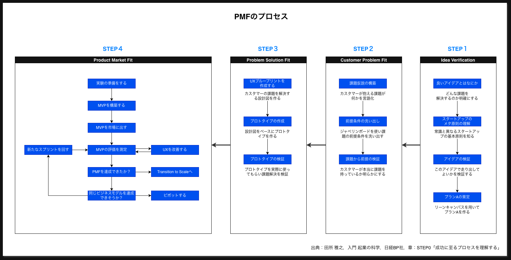

# 概要

このページでは，Agile と PMF を併用した新規プロダクト開発の全体像をまとめる．

## Agileとは？

アジャイル開発とは，変化に柔軟に対応しながら価値を早く継続的に届けることを重視する開発手法であり，その原点は下記の宣言や原則に記載されている．
- [アジャイルソフトウェア開発宣言](https://agilemanifesto.org/iso/ja/manifesto.html)
- [アジャイル宣言の背後にある原則](https://agilemanifesto.org/iso/ja/principles.html)

代表的な実践として，Scrum (1986)，エクストリーム・プログラミング (XP) (1996)などの手法があり，本サイトでは主にScrumを実践した内容を記載している．

## PMFとは？

PMFとは「製品（サービスや商品）が特定の市場において適合している状態」のことで，
参考文献『起業の科学 入門』では，下記の４つのステップを進めていく．

- STEP1. Idea Verification：アイデアが本当にスタートアップにふさわしいものかを検証する
- STEP2. Customer Problem Fit：スタートアップが抱える課題と顧客（カスタマー）が抱える課題が一致しているか確認する段階
- STEP3. Problem Solution Fit：ステップ２で実在を確かめた課題の解決策を描く
- STEP4. Product Market Fit：「人が欲しがるものを作る」段階．実際に製品をテスト販売し，ユーザーの反応を探る

[トップへ戻る](../index.md)
